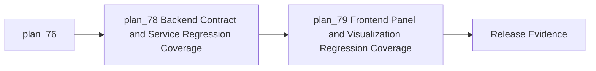
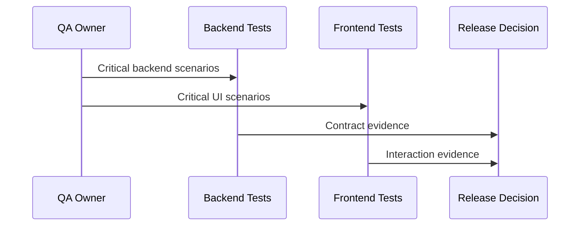

# Module: Regression Coverage and Release Evidence

## Module Overview

### Module Goal
Create targeted regression coverage and release evidence for the traceability workflows that are most likely to regress after production completion work.

### Position in Project
This module is the final release gate. It converts implementation confidence into repeatable evidence across backend contracts, frontend panels, visualization, automation, review, and export workflows.

---

## Dependencies

### Prerequisites
- **Prerequisite Tasks**: plan_76
- **Prerequisite Data**: Critical workflow scenarios, acceptance criteria, known production risks, and test environment constraints.
- **Prerequisite Environment**: Backend and frontend test runners with stable fixtures.

### Downstream Impact
- **Downstream Tasks**: Production readiness decision.
- **Output Data**: Regression evidence, skipped validation list, and residual risk register.

### External Dependencies
- **Third-Party Services**: Mocked or simulated external integrations for deterministic checks.
- **Database**: Test data fixtures for artifacts, links, suggestions, rules, review items, and exports.
- **API Interfaces**: Contract boundaries for all critical traceability workflows.

---

## Subtask Breakdown

- [x] plan_78 - Backend Contract and Service Regression Coverage (complexity: standard)
  - Brief: Add focused backend tests for critical service and API behavior.
- [x] plan_79 - Frontend Panel and Visualization Regression Coverage (complexity: blocked-on-decision)
  - Brief: Add frontend tests for panels, history, validation, visualization, and workflow controls.

---

## Visualization Output

### Module Flowchart


### System Flow Diagram
```text
+---------------------------+
| Critical Workflows        |
+-------------+-------------+
              |
              V
+---------------------------+
| Backend Contract Tests    |
+-------------+-------------+
              |
              V
+---------------------------+
| Frontend Panel Tests      |
+-------------+-------------+
              |
              V
+---------------------------+
| Release Evidence Package  |
+---------------------------+
```

### Interface Collaboration Diagram


### Core Metrics Mapping Table
| Frontend Area | Data Source | Core Metric | Decision Use |
| --- | --- | --- | --- |
| Visualization Panels | Graph and analysis data | Render success and state coverage | Prevent blank or broken views |
| Execution History | Execution records | Status and detail coverage | Diagnose automation reliability |
| Validation Panel | Validation result data | Error and warning display coverage | Prevent invalid rule saves |
| Suggestions and Exports | Workflow state | Action and terminal state coverage | Release readiness |

### Resource Allocation Table
| Resource Type | Owner | Time Window | Key Output | Risk/Notes |
| --- | --- | --- | --- | --- |
| QA | QA owner | Week 4 | Regression matrix | Scenario prioritization |
| Backend | Backend owner | Week 4 | Service and API tests | Fixture stability |
| Frontend | Frontend owner | Week 4 | Component interaction tests | D3 and async rendering |

---

## Technical Solution

### Architecture Design
Use a risk-based test matrix that covers behavior contracts and user interactions without overtesting implementation details.

### Core Technology Selection
- Technology 1: Existing backend test runner
  - Selection Reason: Current service and API tests already use it.
  - Alternative: External contract runner, deferred.
- Technology 2: Existing frontend test runner
  - Selection Reason: Current frontend tests already use it.
  - Alternative: Full end-to-end browser suite for every path, deferred to higher release tier.

### Data Model
Use stable fixtures representing artifacts, links, suggestions, rules, review items, exports, and execution history.

### Interface Design
Define test-visible contracts for critical outputs without binding tests to private implementation details.

---

## Execution Summary

### Input
- Critical workflows.
- Known production risks.
- Completed runtime and UI changes.

### Processing
- Build backend regression tests.
- Build frontend panel and visualization tests.
- Produce validation report with skips and residual risks.

### Output
- Regression coverage.
- Release evidence.
- Known risks and skipped validations.

---

## Risks and Challenges

### Technical Challenges
- Visualization tests can be brittle; mitigate by testing stable user-observable output and state changes.

### Time Risks
- Full coverage is too broad; mitigate with risk-based scenarios tied to production blockers.

### Dependency Risks
- External integrations are unstable in tests; mitigate with deterministic fixtures and simulated responses.

---

## Acceptance Criteria

### Functional Acceptance
- Critical backend workflows have contract or service tests.
- Critical frontend panels have interaction tests.
- Validation report lists what was run and what remains unvalidated.

### Performance Acceptance
- Tests remain fast enough for regular developer use.
- Heavier checks are clearly separated.

### Quality Acceptance
- Tests do not weaken assertions, skip critical paths without reason, or hard-code unrelated implementation details.

---

## Deliverables List

### Code Files
- Backend and frontend test additions.

### Configuration Files
- No CI or deployment configuration changes planned unless explicitly approved.

### Documentation
- Regression matrix and release evidence summary.

### Test Files
- Focused service, API, component, and interaction tests.
