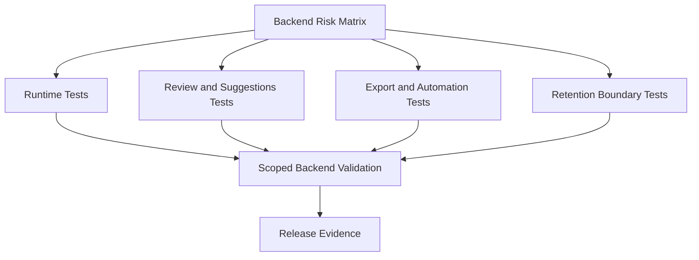

# Task: Backend Contract and Service Regression Coverage

## Task Overview

### Task Description
Add targeted backend regression coverage for transform behavior, review queue lifecycle, suggestion review, export rendering, automation triggers, retention boundaries, and execution history.

### Task Purpose
Backend traceability has meaningful existing coverage, but remaining production gaps need tests that protect workflow contracts rather than only isolated helper behavior.

---

## Dependencies

### Prerequisites
- **Prerequisite Tasks**: plan_75, plan_76
- **Required Resources**: Critical backend scenarios, stable fixtures, and acceptance matrices.
- **Environment Requirements**: Backend test runner and database test setup.

### Downstream Impact
- **Downstream Tasks**: plan_79 and release readiness decision.
- **Provided Output**: Backend regression evidence for production blockers.

---

## Execution Steps

### Step 1: Backend Test Matrix
- **Action**: Define the smallest set of tests that covers production blockers and high-risk workflows.
- **Input**: Plans plan_69 through plan_76.
- **Output**: Backend regression matrix.
- **Notes**: Prioritize behavior boundaries over implementation details.

### Step 2: Runtime and Review Tests
- **Action**: Add tests for transform policy and review queue lifecycle.
- **Input**: Runtime and review acceptance criteria.
- **Output**: Tests for silent failure prevention and review persistence.
- **Notes**: Include permission and audit assertions where relevant. Transform edge cases include invalid input shape, missing node configuration, unsupported transform type, type mismatch in transformed fields, empty input, legacy non-passthrough saved rules, and circular dependency rejection through the existing flow validation path.

### Step 3: Workflow and Export Tests
- **Action**: Add tests for suggestions, exports, and automation triggers.
- **Input**: Workflow acceptance matrices.
- **Output**: API and service regression tests.
- **Notes**: Validate terminal states and content where applicable.

### Step 4: Retention Boundary Tests
- **Action**: Add scenarios for cleanup, archival, deletion, or retention boundaries that could remove traceability artifacts, review items, exports, executions, or audit references.
- **Input**: Current retention policy and persistence relationships.
- **Output**: Regression tests or explicit gap note for retention behavior.
- **Notes**: If no retention policy exists, document the gap rather than inventing deletion semantics.

### Step 5: Validation Report
- **Action**: Run scoped backend checks and record skipped or unvalidated areas.
- **Input**: Completed backend tests.
- **Output**: Backend validation report.
- **Notes**: Do not weaken tests to pass unrelated failures.

---

## Visualization Aids

### Step Flowchart

### Risk Monitoring Table
| Risk Item | Level | Trigger Signal | Mitigation Strategy | Owner |
| --- | --- | --- | --- | --- |
| Tests overfit private implementation | Medium | Refactor breaks tests without behavior change | Assert public contract outcomes | Backend owner |
| Fixtures become too complex | Medium | Test setup obscures behavior | Shared small fixtures | QA owner |
| Skips hide blockers | High | Critical test skipped without reason | Require skip rationale | Release owner |

### File Operations List

#### Files to Create
- Planned backend test artifacts
  - Type: Test source
  - Purpose: Cover high-risk traceability workflows.
  - Content: Runtime, review, suggestions, export, automation, retention, and history scenarios.

#### Files to Modify
- Existing backend test artifacts
  - Modification Location: Traceability test areas.
  - Modification Content: Add missing workflow scenarios.
  - Modification Reason: Improve production regression confidence.

#### Files to Read
- Existing backend traceability test artifacts
  - Read Purpose: Reuse fixtures and avoid duplicate coverage.
  - Usage: Place new tests in the right existing structure.

---

## Implementation List

### Functional Modules
- Backend regression suite
  - Functionality: Validates critical traceability contracts.
  - Interface: Test runner output and validation report.
  - Responsibility: Detect behavior regressions before release.

### Data Structures
- Backend regression matrix
  - Purpose: Maps risk to test scenario.
  - Fields: Risk, workflow, fixture, assertion, priority.

### Algorithm Logic
- Scenario prioritization
  - Purpose: Select high-value tests first.
  - Input: Risk severity and workflow criticality.
  - Output: Ordered test plan.
  - Complexity: Manual risk scoring.

### Interface Definitions
- Backend contract boundary
  - Type: API and service behavior contract.
  - Parameters: Workflow-specific request data.
  - Return: Persisted state and response output.
  - Description: Validates user-visible backend behavior.

---

## Execution Summary

### Input
- Production risk list.
- Acceptance matrices.
- Backend fixtures.

### Processing
- Add focused backend tests.
- Run scoped validation.
- Record skipped checks.

### Output
- Backend regression coverage.
- Validation evidence.
- Residual risk list.

---

## Testing Requirements

### Unit Tests
- Test Scope: Runtime policies and service-level state transitions.
- Test Cases: Transform policy, transform edge cases, review lifecycle, suggestion transitions, trigger state, retention boundaries.
- Coverage Requirement: Critical branch coverage for production blockers.

### Integration Tests
- Test Scope: API request to persisted state.
- Test Scenarios: Suggestion approval creates link, export downloads content, trigger creates history.

### Manual Tests
- Test Point 1: Backend checks run cleanly for changed traceability areas.
- Test Point 2: Any skipped check has a documented reason.

---

## Acceptance Criteria

### Functional Acceptance
- Backend tests cover all identified high-risk production gaps.
- Retention boundary behavior is tested if a policy exists, or explicitly listed as a gap if no policy exists.
- Tests validate persisted state and response contracts.
- Failed dependency paths are explicit.

### Quality Acceptance
- Tests do not weaken assertions or hide failures.
- Existing unrelated test behavior remains unchanged.

### Documentation Acceptance
- Backend validation report lists commands run, skipped checks, and residual risks.

---

## Notes

### Technical Notes
- Prefer deterministic fixtures over live external services.

### Security Notes
- Tests must not read or log real secrets.

### Performance Notes
- Keep default regression checks fast; separate heavier export checks if needed.

### References
- Existing backend traceability test and API contract documentation.
