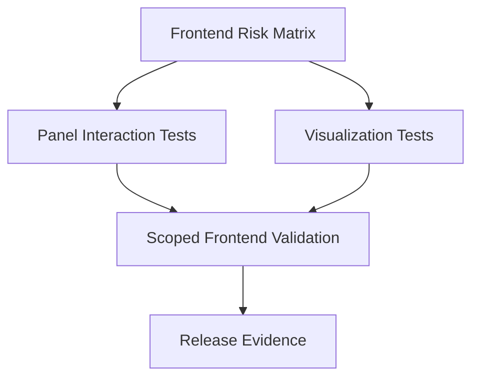

# Task: Frontend Panel and Visualization Regression Coverage

## Task Overview

### Task Description
Add targeted frontend regression coverage for traceability visualization, execution history, validation panel, template dialog, editable properties panel, suggested links, export dialog, and rules management.

### Task Purpose
Frontend traceability has broad functionality but limited test coverage. Production readiness needs tests for high-risk interaction paths, not just page smoke tests.

### AI Executor Constraint
The frontend test runner is configured in the frontend package, but execution requires local Node/npm or the documented Docker tooling container. If neither runtime is available in the current environment, writing tests is possible but a green run is an out-of-scope validation handoff.

---

## Dependencies

### Prerequisites
- **Prerequisite Tasks**: plan_73, plan_75, plan_76, plan_78
- **Required Resources**: UI scenarios, mocked API responses, accessibility expectations, and rendering constraints.
- **Environment Requirements**: Verify the existing frontend test runner first; if local Node/npm is absent, use documented Docker tooling or record the green run as a user-side validation requirement.

### Downstream Impact
- **Downstream Tasks**: Release readiness decision.
- **Provided Output**: Frontend regression evidence and residual UI risk register.

---

## Execution Steps

### Step 1: Frontend Risk Matrix
- **Action**: Prioritize user interactions most likely to regress or hide backend errors.
- **Input**: Current UI surfaces and production risk list.
- **Output**: Frontend regression matrix.
- **Notes**: Cover panels currently mocked or untested and explicitly record whether runner execution is available.

### Step 1A: Runner Availability Check
- **Action**: Verify whether the existing frontend test runner can execute in the current environment.
- **Input**: Frontend package scripts and local or container runtime availability.
- **Output**: Runner availability decision.
- **Notes**: If absent, do not treat missing green run as implementation success; document it as an infrastructure blocker.

### Step 2: Panel Interaction Tests
- **Action**: Add tests for validation, template selection, properties editing, suggestions review, export dialog, and execution history.
- **Input**: Mocked API responses and interaction scenarios.
- **Output**: Component interaction coverage.
- **Notes**: Assert visible user outcomes and state transitions.

### Step 3: Visualization Tests
- **Action**: Add stable tests for graph, impact, orphan, confidence, sync health, and consistency views.
- **Input**: Representative visualization data.
- **Output**: Visualization regression coverage.
- **Notes**: Assert semantic graph state such as node count, edge count, labels, selected state, empty state, and error state; avoid pixel snapshots unless specifically needed.

### Step 4: Validation Report
- **Action**: Run scoped frontend checks and document skipped visual or browser-only areas.
- **Input**: Completed tests.
- **Output**: Frontend validation report.
- **Notes**: Browser screenshot validation can remain a separate release gate if not automated here.

---

## Visualization Aids

### Step Flowchart

### Risk Monitoring Table
| Risk Item | Level | Trigger Signal | Mitigation Strategy | Owner |
| --- | --- | --- | --- | --- |
| Visual graph tests become brittle | Medium | Minor layout changes fail tests | Assert semantic render state | Frontend owner |
| Mocked APIs hide contract drift | High | UI passes with wrong payload shape | Align mocks with backend contracts | QA owner |
| Untested error states persist | Medium | Failed request shows blank panel | Add error and retry scenarios | UI owner |
| Runner unavailable in current environment | High | Node/npm and Docker tooling are absent | Write tests and hand off green run | Frontend owner |
| Frontend mocks drift from backend | High | Mock payload passes but runtime payload fails | Treat backend contract schema as source of truth | QA owner |

### File Operations List

#### Files to Create
- Planned frontend test artifacts
  - Type: Component and interaction test source
  - Purpose: Cover traceability panels and visualization workflows.
  - Content: Loading, empty, success, error, action, and refresh scenarios.

#### Files to Modify
- Existing frontend test artifacts
  - Modification Location: Traceability page and builder test areas.
  - Modification Content: Replace broad mocks with focused component assertions where useful.
  - Modification Reason: Increase meaningful regression coverage.
- Existing UI artifacts
  - Modification Location: Only if tests expose missing accessible labels or unstable state.
  - Modification Content: Minimal testability and accessibility fixes.
  - Modification Reason: Support user-observable behavior.

#### Files to Read
- Existing traceability UI artifacts
  - Read Purpose: Identify real user flows and current mock boundaries.
  - Usage: Build stable test scenarios.

---

## Implementation List

### Functional Modules
- Frontend regression suite
  - Functionality: Validates traceability panel interactions and visualization states.
  - Interface: Test runner output and validation report.
  - Responsibility: Catch user-facing regressions before release.

### Data Structures
- Frontend regression matrix
  - Purpose: Maps UI risk to test scenario.
  - Fields: UI surface, data state, interaction, expected visible result, priority.

### Algorithm Logic
- UI scenario selection
  - Purpose: Prioritize tests by user risk.
  - Input: Feature readiness gaps and current coverage.
  - Output: Ordered test scenarios.
  - Complexity: Manual risk scoring.

### Interface Definitions
- UI interaction boundary
  - Type: Component behavior contract.
  - Parameters: Mocked API state and user action.
  - Return: Visible UI state.
  - Description: Confirms user-visible traceability behavior.

---

## Execution Summary

### Input
- UI risk matrix.
- Mocked API payloads.
- User interaction scenarios.

### Processing
- Add panel tests.
- Add visualization tests.
- Run scoped frontend validation.
- Document unvalidated browser-only areas.

### Output
- Frontend regression coverage.
- Validation report.
- Residual UI risk register.

---

## Testing Requirements

### Unit Tests
- Test Scope: Component rendering and local interaction behavior.
- Test Cases: Loading, empty, success, error, approve, reject, export, validation errors, property edits.
- Coverage Requirement: Critical interaction coverage for traceability panels.

### Integration Tests
- Test Scope: Page-level workflow with mocked API boundaries.
- Test Scenarios: Rules management, suggestion review, export dialog, execution history expansion, visualization tabs.

### Manual Tests
- Test Point 1: Browser smoke test verifies graph and matrix views are not blank.
- Test Point 2: Mobile and desktop layouts show controls without overlap.
- Test Point 3: If no local test runner is available, user or CI runs the frontend test command in an environment with Node/npm or Docker tooling.

---

## Acceptance Criteria

### Functional Acceptance
- Critical frontend panels have meaningful tests.
- Visualization views render expected semantic content for representative data.
- Error, empty, loading, and success states are covered.

### Quality Acceptance
- Tests assert user-visible behavior.
- Mock payloads match backend contracts.
- Known browser-only validation gaps are listed.
- Runner availability and any skipped green run are reported explicitly.

### Documentation Acceptance
- Frontend validation report lists commands run, skipped checks, and residual risks.

---

## Notes

### Technical Notes
- Prefer semantic queries and stable labels over implementation selectors.

### Security Notes
- Test payloads must not include real secrets or production data.

### Performance Notes
- Keep component tests fast; reserve heavy browser checks for targeted visual validation.

### References
- Existing frontend traceability pages, panels, and test conventions.
